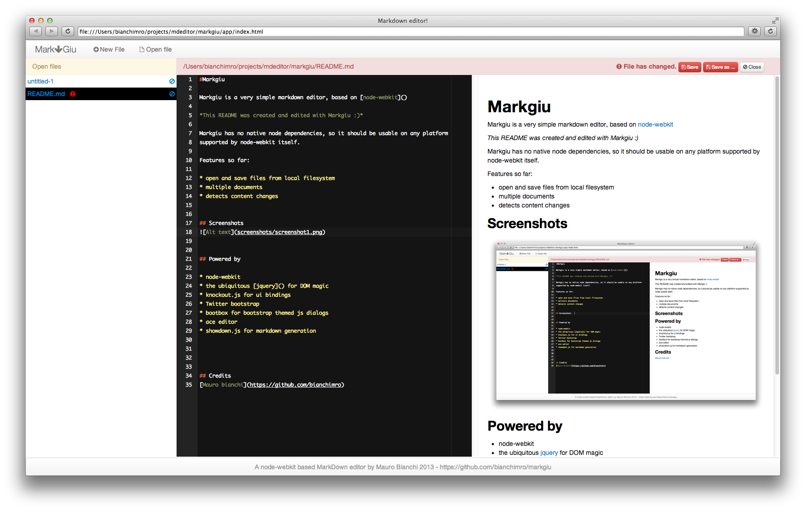

#Markgiu

Markgiu is a very simple markdown editor, based on [node-webkit](https://github.com/rogerwang/node-webkit).

This README was created and edited with Markgiu :)

This is my first experiment with node-webkit, and it leverages some popular js
libraries that I commonly use in the browser, client side.

The code base is very simple, it is based on a couple of [knockout.js](http://knockoutjs.com/)
View-Models. 
See "powered by" section down here for a full listing of used libraries.

Markgiu has no native node dependencies, so it should be usable on any platform
supported by node-webkit itself.

Features so far:

* open and save files from local filesystem
* html preview 
* multiple documents
* detects content changes
* basic support for adding a document with a wiki-style syntax

## Disclaimer
This project does not aim to be a full-featured markdown edito.
Use it at your own risk and abuse the code base at your wish.

## Screenshot  

## Installation and usage
This is a node webkit-app, see:
https://github.com/rogerwang/node-webkit/wiki/How-to-run-apps

In short:

* Download the source of node-webkit or a binary distribution for your platform from
 [https://github.com/rogerwang/node-webkit](https://github.com/rogerwang/node-webkit)   

* clone this repo:
   
        git clone https://github.com/bianchimro/markgiu.git

* run node-webkit like this
        
        open -n -a node-webkit markgiu/app

## Powered by

* [node-webkit](https://github.com/rogerwang/node-webkit)
* the ubiquitous [jquery](http://jquery.com/) for DOM magic
* [knockout.js](http://knockoutjs.com/) for ui bindings
* Twitter [bootstrap](http://twitter.github.com/bootstrap/) for css/js ui
* [Font-awesome](https://github.com/FortAwesome/Font-Awesome) iconic font by Dave Gandy
* [bootbox](http://bootboxjs.com/) for bootstrap themed js dialogs
* [ace editor](http://ace.ajax.org/), a full-featured code editor
* [showdown.js](https://github.com/coreyti/showdown) for markdown generation

## License
This code is released under the MIT license, see the file LICENSE.md.

## Credits
[Mauro bianchi](https://github.com/bianchimro)

## Contact
bianchimro@gmail.com
